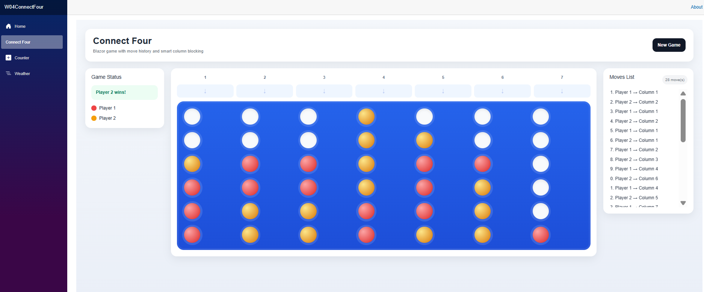

# 🎮 Connect Four - Blazor Web App



A modern and interactive Connect Four game built with **.NET Blazor**.

This project demonstrates how to create dynamic web applications using **C# and Razor components**, following best practices in state management and UI design.

---

## 🌐 Live Demo

(Add your video link here)

---

## 🚀 Features

- 🎯 Two-player interactive gameplay
- 🔄 Turn-based system
- 🏆 Automatic win detection (horizontal, vertical, diagonal)
- ⚖️ Draw detection
- 📜 Move history tracking *(custom feature)*
- 🚫 Smart column blocking when full *(custom feature)*
- 🎨 Clean and responsive UI design

---

## 🧠 Architecture & Concepts

This project applies key frontend and backend concepts using Blazor:

- Component-based architecture
- State management in C#
- Event-driven UI updates
- Separation of concerns (UI vs logic)
- Defensive programming (safe index handling)

---

## 🛠️ Tech Stack

- **.NET 10**
- **Blazor Server**
- **C#**
- **Razor Components**
- **CSS**

---

## ▶️ Getting Started

### 1. Clone repository

```bash
git clone https://github.com/Ichlaura/W04-ConnectFour-Blazor.git
cd W04-ConnectFour-Blazor
2. Run the app
dotnet run
3. Open in browser
http://localhost:5114/connectfour
📚 Source & Credits

This project is based on the Microsoft Learn module:

https://learn.microsoft.com/en-us/training/modules/dotnet-connect-four/

Additional features and UI improvements were implemented independently.

💡 Key Learnings
Building interactive web apps using Blazor instead of JavaScript
Managing application state in a component-based architecture
Handling user input and UI updates efficiently
Debugging runtime issues (index errors, event handling)
Designing clean and user-friendly interfaces
👩‍💻 Author

Laura Nunez
BYU–Idaho — CSE 325
2026 Block 2

📌 Future Improvements
🤖 Add AI opponent
🎞️ Piece drop animations
🎨 Theme customization
🌍 Deploy online (Azure / Render)
